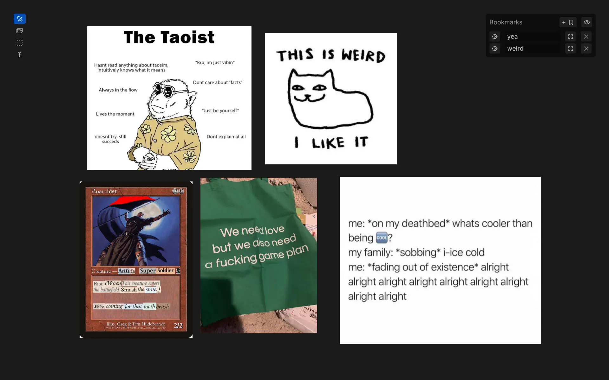

# big

A simple infinite canvas to organize image and text.

Features include:

- _Bookmarks_: remember views and jump back to them
- _Resolve relocated images_: if an image in a file is moved elsewhere in a project folder then it's path will be updated



## Setup

Required `ffmpeg` dependencies for creating video thumbnails:

```bash
zypper in ffmpeg-8-libavutil-devel ffmpeg-8-libavformat-devel ffmpeg-8-libavfilter-devel ffmpeg-8-libavdevice-devel
```
